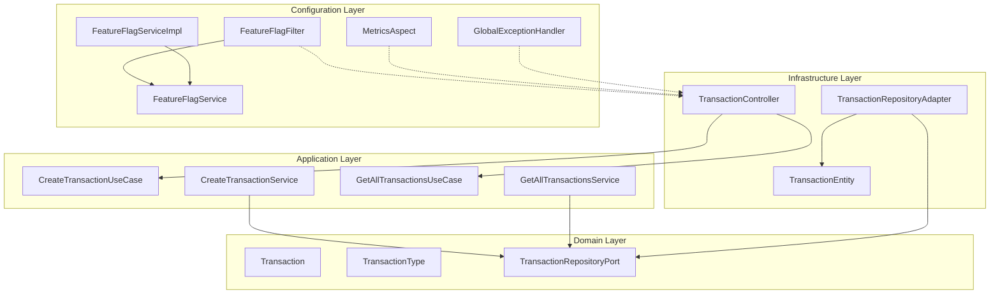

# Development View - Module Organization

## Package Structure


## Dependency Flow



## Module Responsibilities

### Domain Layer (`domain/`)
- **Purpose**: Core business logic and rules
- **Dependencies**: None (pure Java)
- **Key Classes**:
  - `Transaction`: Business entity with validation
  - `TransactionType`: Business enumeration
  - `TransactionRepositoryPort`: Repository interface

### Application Layer (`application/usecase/`)
- **Purpose**: Application services and use case orchestration
- **Dependencies**: Domain layer only
- **Key Classes**:
  - `CreateTransactionUseCase`: Interface for transaction creation
  - `CreateTransactionService`: Implementation of creation logic
  - `GetAllTransactionsUseCase`: Interface for transaction retrieval
  - `GetAllTransactionsService`: Implementation of retrieval logic

### Infrastructure Layer (`adapters/`)
- **Purpose**: External system integration and persistence
- **Dependencies**: Application and Domain layers
- **Key Classes**:
  - `TransactionController`: REST API controller (inbound adapter)
  - `IdempotencyFilter`: HTTP filter for idempotency key processing (inbound adapter)
  - `TransactionRepositoryAdapter`: JPA repository implementation (outbound adapter)
  - `DatabaseIdempotencyAdapter`: Database-backed idempotency storage (outbound adapter)
  - `IdempotencyCleanupScheduler`: Scheduled task for cleaning expired keys (outbound adapter)
  - `TransactionEntity`: Database entity mapping
  - `IdempotencyEntity`: Idempotency key database entity

### Configuration Layer (`config/`)
- **Purpose**: Cross-cutting concerns and system configuration
- **Dependencies**: Used by all layers
- **Key Classes**:
  - `FeatureFlagService`: Interface for feature flag checking
  - `FeatureFlagServiceImpl`: Implementation reading from application.yml
  - `FeatureFlagFilter`: HTTP filter for feature flag enforcement
  - `MetricsAspect`: AOP for metrics collection
  - `GlobalExceptionHandler`: Centralized error handling

### Application Layer (`application/port/`)
- **Purpose**: Application ports defining contracts for external systems
- **Dependencies**: Domain layer only
- **Key Interfaces**:
  - `TransactionRepositoryPort`: Repository contract for transaction persistence
  - `IdempotencyRepositoryPort`: Repository contract for idempotency key storage
    - Methods: `getCachedResponse()`, `storeResponse()`, `isValidKey()`, `hasKeyWithDifferentHash()`, `deleteExpiredKeys()`

## Build Configuration

### Maven Structure
```
pom.xml
src/
├── main/
│   ├── java/
│   │   └── com/example/ledger/
│   └── resources/
│       ├── application.yml
│       └── transaction.http
└── test/
    └── java/
        └── com/example/ledger/
```

### Key Dependencies
- **Spring Boot Starter Web**: REST API framework
- **Spring Boot Starter Data JPA**: Database persistence
- **SpringDoc OpenAPI**: API documentation
- **Micrometer**: Metrics collection
- **H2 Database**: In-memory database
- **Spring Boot Starter Test**: Testing framework

## Testing Strategy

### Test Organization
```
src/test/java/com/example/ledger/
├── adapters/in/web/
│   ├── TransactionControllerTest.java
│   ├── TransactionControllerIdempotencyTest.java
│   ├── TransactionMetricsIntegrationTest.java
│   └── IdempotencyMetricsIntegrationTest.java
├── adapters/out/persistence/
│   └── DatabaseIdempotencyAdapterTest.java
├── application/usecase/
│   ├── CreateTransactionServiceTest.java
│   └── GetAllTransactionsServiceTest.java
├── config/
│   └── IdempotencyCleanupSchedulerTest.java
├── domain/model/
│   └── TransactionTest.java
└── bdd/
    ├── CucumberTestRunner.java
    ├── TransactionStepDefinitions.java
    └── IdempotencyStepDefinitions.java
```

### Test Types
- **Unit Tests**: Domain model validation and business logic
- **Integration Tests**: Controller endpoints and repository interactions
- **Feature Flag Tests**: Filter behavior validation with configurable service
- **Metrics Tests**: AOP metrics collection validation
- **Idempotency Tests**: Idempotency key processing, caching, and conflict detection
- **BDD Tests**: Cucumber feature files with step definitions for behavior validation
- **Scheduler Tests**: Scheduled task execution and error handling

### Test Configuration
- **Test Profile**: Tests use `@ActiveProfiles("test")` to load `application-test.yml`
- **Database**: H2 in-memory database configured in test profile
- **Isolation**: Each test class uses its own Spring context for isolation

## Development Guidelines

### Code Organization Principles
1. **Dependency Inversion**: High-level modules don't depend on low-level modules
2. **Interface Segregation**: Small, focused interfaces
3. **Single Responsibility**: Each class has one reason to change
4. **Open/Closed**: Open for extension, closed for modification

### Naming Conventions
- **Domain Models**: Business-focused names (Transaction, TransactionType)
- **Use Cases**: Action-oriented names (CreateTransaction, GetAllTransactions)
- **Adapters**: Technology-specific names (TransactionController, TransactionRepositoryAdapter)
- **Configuration**: Cross-cutting concern names (FeatureFlagService, FeatureFlagFilter, MetricsAspect)
