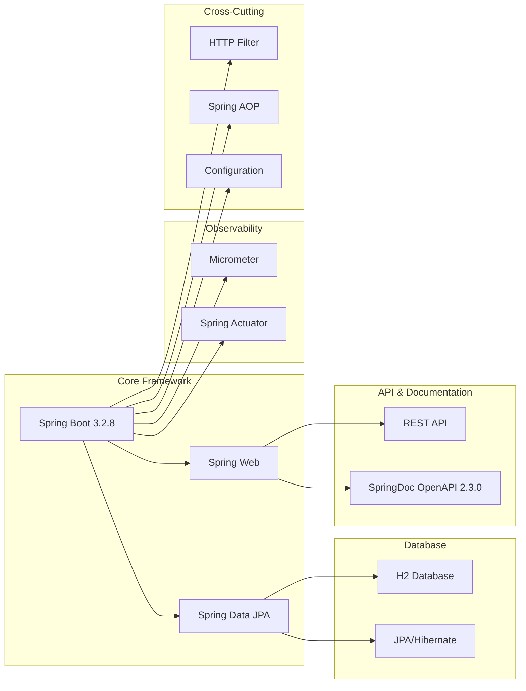

# Physical View - Deployment Architecture

## Runtime Environment

## Technology Stack

## Deployment Configuration

### Application Properties
- **Server Port**: 8080 (default)
- **Database**: H2 in-memory
- **Metrics**: Exposed via Actuator
- **API Documentation**: Swagger UI enabled

### Environment Variables
- `feature.create-transaction.enabled`: Feature flag for transaction creation
- `feature.get-all-transactions.enabled`: Feature flag for transaction retrieval

### Health Checks
- **Application Health**: `/actuator/health`
- **Metrics**: `/actuator/metrics`
- **Info**: `/actuator/info`

## Scalability Considerations

### Horizontal Scaling
- **Stateless Design**: No session state stored in application
- **Database**: H2 in-memory (single instance limitation)
- **Load Balancing**: Ready for multiple instances behind load balancer

### Performance Characteristics
- **In-Memory Database**: Fast read/write operations
- **Connection Pooling**: Spring Boot default HikariCP
- **Caching**: No explicit caching (can be added for production)

### Production Readiness
- **Database**: Replace H2 with PostgreSQL/MySQL for production
- **Monitoring**: Add application monitoring (Prometheus, Grafana)
- **Logging**: Configure structured logging
- **Security**: Add authentication/authorization
